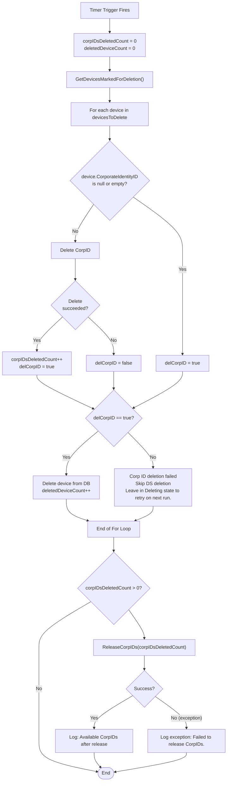

```mermaid

flowchart TD
    A["Timer Trigger Fires"] --> B["corpIDsDeletedCount = 0<br/>deletedDeviceCount = 0"]
    B --> D["GetDevicesMarkedForDeletion()"]
    D --> F["For each device in devicesToDelete"]

    F --> H{"device.CorporateIdentityID<br/>is null or empty?"}

    H -- "No" --> I["Delete CorpID"]
    I --> J{"Delete<br/>succeeded?"}
    J -- "Yes" --> K["corpIDsDeletedCount++<br/>delCorpID = true<br/>"]
    J -- "No" --> M["delCorpID = false"]

    H -- "Yes" --> N["delCorpID = true"]

    K --> O{"delCorpID == true?"}
    M --> O
    N --> O

    O -- "Yes" --> P["Delete device from DB<br/>deletedDeviceCount++"]
    O -- "No" --> Q["Corp ID deletion failed<br/>Skip DS deletion<br/>Leave in Deleting state to retry on next run."]

    P --> Z["End of For Loop"]
    Q --> Z

    Z --> AA{"corpIDsDeletedCount > 0?"}
    AA -- "No" --> END(["End"])
    AA --> AC["ReleaseCorpIDs(corpIDsDeletedCount)"]
    AC --> AD{"Success?"}
    AD -- "Yes" --> AE["Log: Available CorpIDs after release"]
    AD -- "No (exception)" --> AF["Log exception: Failed to release CorpIDs."]
    AE --> END
    AF --> END

```