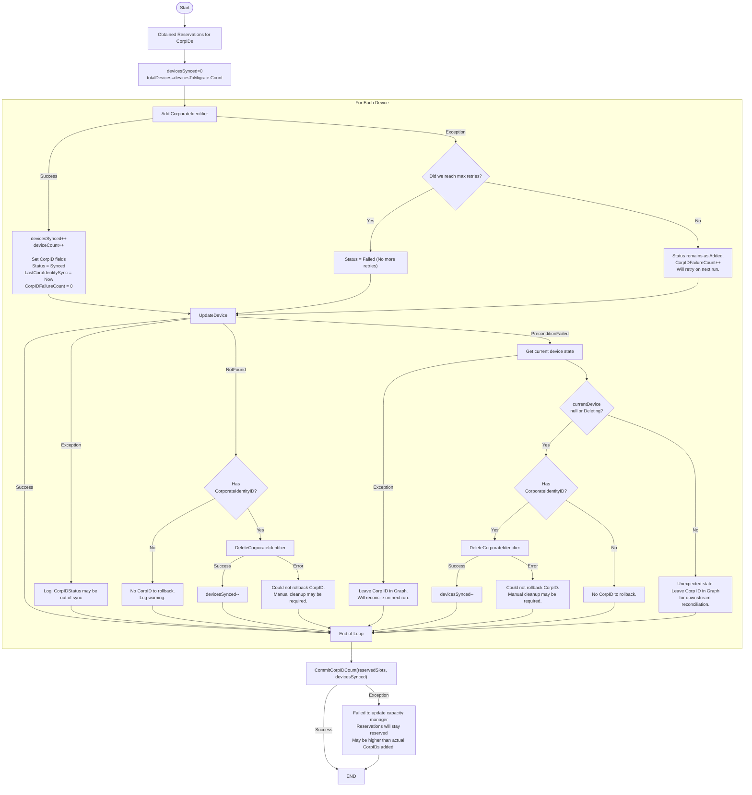

```mermaid

flowchart TD
	START([Start]) --> CAPG[Obtained Reservations for CorpIDs]
	CAPG --> INIT["devicesSynced=0<br/>totalDevices=devicesToMigrate.Count"]
	INIT --> ACI

	subgraph LOOP ["For Each Device"]
        direction TB

	    ACI[Add CorporateIdentifier]

	    ACI -->|Success| ACIS["devicesSynced++<br/>deviceCount++<br/><br/>Set CorpID fields<br/>Status = Synced<br/>LastCorpIdentitySync = Now<br/>CorpIDFailureCount = 0"]
	    ACI -->|Exception| MRC{"Did we reach max retries?"}
	    MRC -->|Yes| SFA["Status = Failed (No more retries)"]
	    MRC -->|No| LRY["Status remains as Added.<br/>CorpIDFailureCount++<br/>Will retry on next run."]
	    ACIS --> UD
	    SFA --> UD
	    LRY --> UD
	
	    UD[UpdateDevice] -->|Success| Z 
	    UD -->|Exception| UDEX["Log: CorpIDStatus may be out of sync"]
	    UDEX --> Z
	    
	    UD -->|NotFound| UDNFC{"Has<br/>CorporateIdentityID?"}
	    UDNFC -->|No| UDNFC2["No CorpID to rollback.<br/>Log warning."]
		UDNFC2 --> Z
	    UDNFC -->|Yes| UDNFD[DeleteCorporateIdentifier]
	    UDNFD -->|Success| UDNFS["devicesSynced--"]
		UDNFS --> Z
	    UDNFD -->|Error| UDNFEX["Could not rollback CorpID.<br/>Manual cleanup may be required."]
	    UDNFEX --> Z
	    
	    UD -->|PreconditionFailed| PFF["Get current device state"]
	    PFF -->|Exception| PFEX["Leave Corp ID in Graph.<br/>Will reconcile on next run."]
	    PFEX --> Z
	    PFF --> PFS
	    
	    PFS{"currentDevice<br/>null or Deleting?"}
	    
	    PFS -->|Yes| PFDC{"Has<br/>CorporateIdentityID?"}
	    PFDC -->|Yes| PFDCR[DeleteCorporateIdentifier]
	    PFDCR -->|Success| PFDCS["devicesSynced--"]
	    PFDCS --> Z
	    PFDCR -->|Error| PFDCE["Could not rollback CorpID.<br/>Manual cleanup may be required."]
	    PFDCE --> Z
	    PFDC -->|No| PFDCN["No CorpID to rollback."]
		PFDCN --> Z

	    PFS -->|No| PFUNK["Unexpected state.<br/>Leave Corp ID in Graph<br/>for downstream reconciliation."]
	    PFUNK --> Z[End of Loop]
	

	end
	
	Z --> CMT["CommitCorpIDCount(reservedSlots, devicesSynced)"]
	CMT -->|Success| END
	CMT -->|Exception| CMTE["Failed to update capacity manager<br/>Reservations will stay reserved<br/>May be higher than actual CorpIDs added."]
	CMTE --> END

```