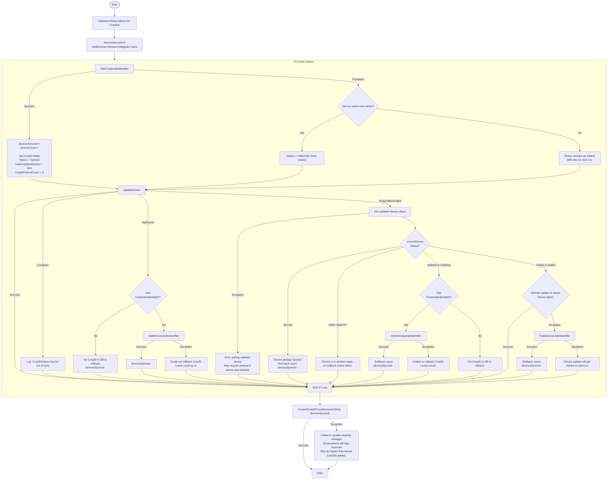

```mermaid

flowchart TD
	START([Start]) --> CAPG[Obtained Reservations for CorpIDs]
	CAPG --> INIT["devicesSynced=0<br/>totalDevices=devicesToMigrate.Count"]
	INIT --> LOOP

	subgraph LOOP ["For Each Device"]
        direction TB

	    ACI[Add CorporateIdentifier]

	    ACI -->|Success| ACIS["devicesSynced++<br/>deviceCount++<br/><br/>Set CorpID fields<br/>Status = Synced<br/>LastCorpIdentitySync = Now<br/>CorpIDFailureCount = 0"]
	    ACI -->|Exception| MRC{"Did we reach max retries?"}
	    MRC -->|Yes| SFA["Status = Failed (No more retries)"]
	    MRC -->|No| LRY["Status remains as Added.<br/>Will retry on next run."]
	    ACIS --> UD
	    SFA --> UD
	    LRY --> UD
	
	    UD[UpdateDevice] -->|Success| Z 
	    UD -->|Exception| UDEX["Log: CorpIDStatus may be out of sync"]
	    UDEX --> Z
	    
	    UD -->|NotFound| UDNFC{"Has<br/>CorporateIdentityID?"}
	    UDNFC -->|No| UDNFC2["No CorpID in DB to rollback.<br/>devicesSynced--"]
		UDNFC2 --> Z
	    UDNFC -->|Yes| UDNFD[DeleteCorporateIdentifier]
	    UDNFD -->|Success| UDNFS["devicesSynced--"]
		UDNFS --> Z
	    UDNFD -->|Exception| UDNFEX["Could not rollback CorpID.<br/>Leave count as is."]
	    UDNFEX --> Z
	    
	    UD -->|PreconditionFailed| PFF["Get updated device object"]
	    PFF -->|Exception| PFEX["Error getting updated device<br/>May require cleanup if device was deleted."]
	    PFEX --> Z
	    PFF --> PFS
	    
	    PFS{currentDevice<br/>Status?}
	    
	    PFS -->|Synced| PFSY["Device already Synced.<br/>Roll back count.</br>devicesSynced--"]
	    PFSY --> Z

	    PFS -->|Other State???| PFUNK["Device is in another state, no rollback action taken."]
	    PFUNK --> Z[End of Loop]

	    PFS -->|"Deleted or Deleting"| PFDC{"Has<br/>CorporateIdentityID?"}
	    PFDC -->|Yes| PFDCR[DeleteCorporateIdentifier]
	    PFDCR -->|Success| PFDCS["Rollback count<br/>devicesSynced--"]
	    PFDCS --> Z
	    PFDCR -->|Exception| PFDCE["Unable to rollback CorpID.<br/>Leave count."]
	    PFDCE --> Z
	    PFDC -->|No| PFDCN["No CorpID in DB to rollback."]
		PFDCN --> Z
	
	    
	    PFS -->|"Failed or Added"| PFFU{"Attempt update to newer device object."}
	    PFFU -->|Success| Z
	    PFFU -->|Exception| PFFUDR[DeleteCorporateIdentifier]
	    PFFUDR -->|"Success"| PFFUDS2["Rollback count:<br/>devicesSynced--"]
	    PFFUDS2 --> Z
	    PFFUDR -->|Exception| PFFUDRE["Device update will get retried on next run."]
	    PFFUDRE --> Z
	

	end
	
	Z --> CMT["CommitCorpIDCount(reservedSlots, devicesSynced)"]
	CMT -->|Success| END
	CMT -->|Exception| CMTE["Failed to update capacity manager<br/>Reservations will stay reserved<br/>May be higher than actual CorpIDs added."]
	CMTE --> END

```