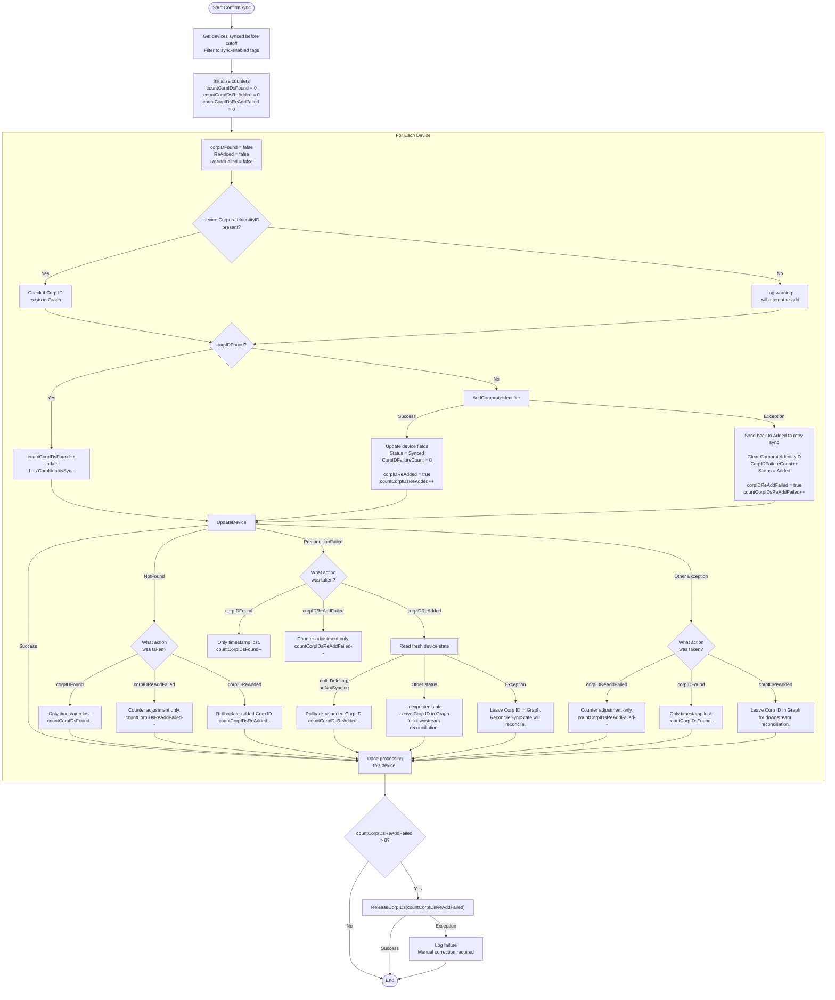

```mermaid

flowchart TD
    A([Start ConfirmSync]) --> K[Get devices synced before cutoff<br/>Filter to sync-enabled tags]
    K --> L[Initialize counters<br/>countCorpIDsFound = 0<br/>countCorpIDsReAdded = 0<br/>countCorpIDsReAddFailed = 0]
    L --> LOOP

    subgraph LOOP ["For Each Device"]
        direction TB
        N[corpIDFound = false<br/>ReAdded = false<br/>ReAddFailed = false] --> O{device.CorporateIdentityID<br/>present?}
        O -- Yes --> P[Check if Corp ID<br/>exists in Graph]
        O -- No --> Q[Log warning:<br/>will attempt re-add]
        P --> R{corpIDFound?}
        Q --> R
        R -- Yes --> S[countCorpIDsFound++<br/>Update LastCorpIdentitySync]
        R -- No --> U[AddCorporateIdentifier]
        U -- Success --> V[Update device fields<br/>Status = Synced<br/>CorpIDFailureCount = 0<br/><br/>corpIDReAdded = true<br/>countCorpIDsReAdded++]
        U -- Exception --> W[Send back to Added to retry sync<br/><br/>Clear CorporateIdentityID<br/>CorpIDFailureCount++<br/>Status = Added<br/><br/>corpIDReAddFailed = true<br/>countCorpIDsReAddFailed++]
        S --> X[UpdateDevice]
        V --> X
        W --> X
        X -- Success --> END[Done processing<br/>this device.]

        X -- NotFound --> NF1{What action<br/>was taken?}
        NF1 -- corpIDFound --> NF2[Only timestamp lost.<br/>countCorpIDsFound--]
        NF1 -- corpIDReAddFailed --> NF3[Counter adjustment only.<br/>countCorpIDsReAddFailed--]
        NF1 -- corpIDReAdded --> NF4[Rollback re-added Corp ID.<br/>countCorpIDsReAdded--]
        NF2 --> END
        NF3 --> END
        NF4 --> END

        X -- PreconditionFailed --> PF1{What action<br/>was taken?}
        PF1 -- corpIDFound --> PF2[Only timestamp lost.<br/>countCorpIDsFound--]
        PF1 -- corpIDReAddFailed --> PF3[Counter adjustment only.<br/>countCorpIDsReAddFailed--]
        PF1 -- corpIDReAdded --> PF4[Read fresh device state]
        PF4 -- "null, Deleting,<br/>or NotSyncing" --> PF6[Rollback re-added Corp ID.<br/>countCorpIDsReAdded--]
        PF4 -- Other status --> PF7[Unexpected state.<br/>Leave Corp ID in Graph<br/>for downstream reconciliation.]
        PF4 -- Exception --> PF8[Leave Corp ID in Graph.<br/>ReconcileSyncState will reconcile.]
        PF6 --> END
        PF7 --> END
        PF8 --> END

        X -- Other Exception --> OE1{What action<br/>was taken?}
        OE1 -- corpIDReAddFailed --> OE2[Counter adjustment only.<br/>countCorpIDsReAddFailed--]
        OE1 -- corpIDFound --> OE3[Only timestamp lost.<br/>countCorpIDsFound--]
        OE1 -- corpIDReAdded --> OE4[Leave Corp ID in Graph<br/>for downstream reconciliation.]
        OE2 --> END
        OE3 --> END
        OE4 --> END
    end

    END --> AA{countCorpIDsReAddFailed > 0?}
    AA -- No --> AB([End])
    AA -- Yes --> AC["ReleaseCorpIDs(countCorpIDsReAddFailed)"]
    AC -- Success --> AB
    AC -- Exception --> AD[Log failure<br/>Manual correction required]
    AD --> AB
        
```