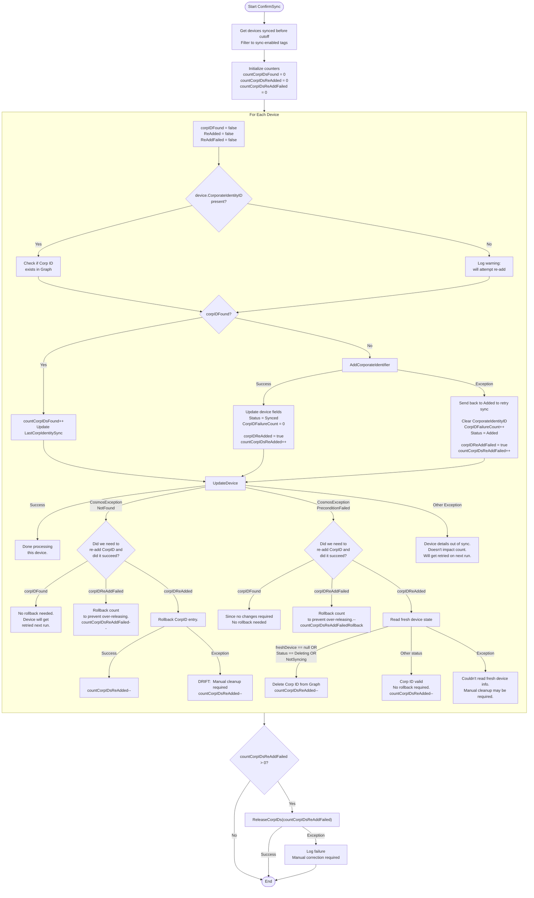

```mermaid

flowchart TD
    A([Start ConfirmSync]) --> K[Get devices synced before cutoff<br/>Filter to sync-enabled tags]
    K --> L[Initialize counters<br/>countCorpIDsFound = 0<br/>countCorpIDsReAdded = 0<br/>countCorpIDsReAddFailed = 0]
    L --> LOOP

    subgraph LOOP ["For Each Device"]
        direction TB
        N[corpIDFound = false<br/>ReAdded = false<br/>ReAddFailed = false] --> O{device.CorporateIdentityID<br/>present?}
        O -- Yes --> P[Check if Corp ID<br/>exists in Graph]
        O -- No --> Q[Log warning:<br/>will attempt re-add]
        P --> R{corpIDFound?}
        Q --> R
        R -- Yes --> S[countCorpIDsFound++<br/>Update LastCorpIdentitySync]
        R -- No --> U[AddCorporateIdentifier]
        U -- Success --> V[Update device fields<br/>Status = Synced<br/>CorpIDFailureCount = 0<br/><br/>corpIDReAdded = true<br/>countCorpIDsReAdded++]
        U -- Exception --> W[Send back to Added to retry sync<br/><br/>Clear CorporateIdentityID<br/>CorpIDFailureCount++<br/>Status = Added<br/><br/>corpIDReAddFailed = true<br/>countCorpIDsReAddFailed++]
        S --> X[UpdateDevice]
        V --> X
        W --> X
        X -- Success --> Y[Done processing<br/>this device.]

        X -- CosmosException<br/>NotFound --> NF1{Did we need to<br/>re-add CorpID and<br/>did it succeed?}
        NF1 -- corpIDFound --> NF2[No rollback needed.<br/>Device will get<br/>retried next run.]
        NF1 -- corpIDReAddFailed --> NF3[Rollback count<br/>to prevent over-releasing.<br/>countCorpIDsReAddFailed--]
        NF1 -- corpIDReAdded --> NF4[Rollback CorpID entry.]
        NF4 -- Success --> NF5[<br/>countCorpIDsReAdded--]
        NF4 -- Exception --> NF6[DRIFT:  Manual cleanup required<br/>countCorpIDsReAdded--]

        X -- CosmosException<br/>PreconditionFailed --> PF1{Did we need to<br/>re-add CorpID and<br/>did it succeed?}
        PF1 -- corpIDFound --> PF2[Since no changes required<br/>No rollback needed]
        PF1 -- corpIDReAddFailed --> PF3[Rollback count<br/>to prevent over-releasing.--countCorpIDsReAddFailedRollback ]
        PF1 -- corpIDReAdded --> PF4[Read fresh device state]
        PF4 -- freshDevice == null OR<br/> Status == Deleting OR<br/>NotSyncing --> PF6[Delete Corp ID from Graph<br/>countCorpIDsReAdded--]
        PF4 -- Other status --> PF7[Corp ID valid<br/>No rollback required.<br/>countCorpIDsReAdded--]
        PF4 -- Exception --> PF8[Couldn't read fresh device info.<br/>Manual cleanup may be required.]

        X -- Other Exception --> OE[Device details out of sync.<br/>Doesn't impact count.<br/>Will get retried on next run.]
    end

    LOOP --> AA{countCorpIDsReAddFailed > 0?}
    AA -- No --> AB([End])
    AA -- Yes --> AC["ReleaseCorpIDs(countCorpIDsReAddFailed)"]
    AC -- Success --> AB
    AC -- Exception --> AD[Log failure<br/>Manual correction required]
    AD --> AB
        
```