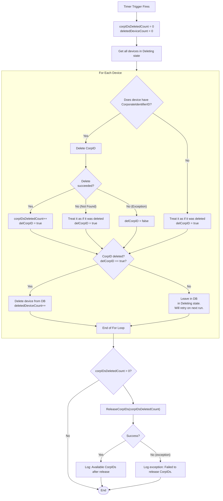

```mermaid

flowchart TD
    A["Timer Trigger Fires"] --> B["corpIDsDeletedCount = 0<br/>deletedDeviceCount = 0"]
    B --> D["Get all devices in Deleting state"]
    D --> LOOP

    subgraph LOOP ["For Each Device"]
        direction TB

        H{"Does device have CorporateIdentifierID?"}

        H -- "No" --> N["Treat it as if it was deleted<br/>delCorpID = true"]
        H -- "Yes" --> I["Delete CorpID"]
        I --> J{"Delete<br/>succeeded?"}
        J -- "Yes" --> K["corpIDsDeletedCount++<br/>delCorpID = true<br/>"]
        J -- "No (Not Found)" --> M["Treat it as if it was deleted<br/>delCorpID = true"]
        J -- "No (Exception)" --> MM["delCorpID = false"]

    
        K --> O{"CorpID deleted?<br/>delCorpID == true?"}
        M --> O
        MM --> O
        N --> O

        O -- "Yes" --> P["Delete device from DB<br/>deletedDeviceCount++"]
        O -- "No" --> Q["Leave in DB<br/>in Deleting state.<br/>Will retry on next run."]

        P --> Z["End of For Loop"]
    end

    Q --> Z

    Z --> AA{"corpIDsDeletedCount > 0?"}
    AA -- "No" --> END(["End"])
    AA --> AC["ReleaseCorpIDs(corpIDsDeletedCount)"]
    AC --> AD{"Success?"}
    AD -- "Yes" --> AE["Log: Available CorpIDs after release"]
    AD -- "No (exception)" --> AF["Log exception: Failed to release CorpIDs."]
    AE --> END
    AF --> END

```