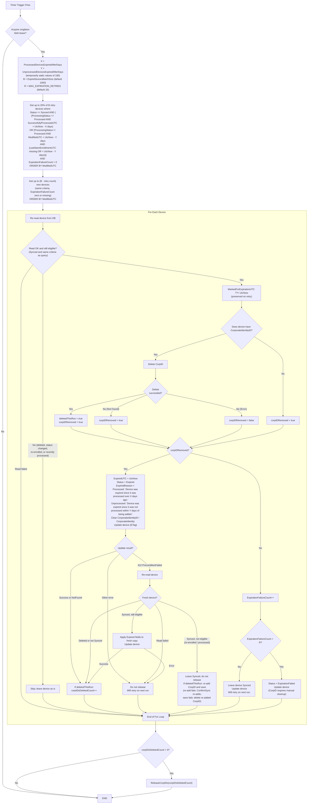

Expiration is calculated at run time from the current settings, so changing either setting applies to all existing devices.
`MarkedForExpirationUTC` records when expiration processing started for a device and is persisted with the outcome update.
Each device is re-read right before its CorpID is deleted so that a device UpdateDevices/StragglerHandler just recorded as enrolled or processed stays Synced. CorpID slots are released only when the outcome is persisted (over-counting is the safe failure).
