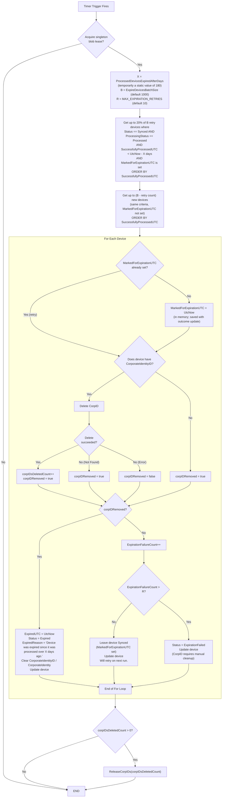

```mermaid

flowchart TD
    A["Timer Trigger Fires"] --> L{"Acquire singleton<br/>blob lease?"}
    L -- "No" --> END
    L -- "Yes" --> S["X = ProcessedDevicesExpiredAfterDays<br/>(temporarily a static value of 180)<br/>B = ExpireDevicesBatchSize (default 1000)<br/>R = MAX_EXPIRATION_RETRIES (default 10)"]
    S --> DR["Get up to 20% of B retry devices where<br/>Status == Synced AND ProcessingStatus == Processed<br/>AND SuccessfullyProcessedUTC < UtcNow - X days<br/>AND MarkedForExpirationUTC is set<br/>ORDER BY SuccessfullyProcessedUTC"]
    DR --> D["Get up to (B - retry count) new devices<br/>(same criteria, MarkedForExpirationUTC not set)<br/>ORDER BY SuccessfullyProcessedUTC"]
    D --> LOOP

    subgraph LOOP ["For Each Device"]
        direction TB

        RT{"MarkedForExpirationUTC<br/>already set?"}
        RT -- "Yes (retry)" --> H
        RT -- "No" --> MK["MarkedForExpirationUTC = UtcNow<br/>(in memory; saved with outcome update)"]
        MK --> H{"Does device have CorporateIdentityID?"}

        H -- "No" --> N["corpIDRemoved = true"]
        H -- "Yes" --> I["Delete CorpID"]
        I --> J{"Delete<br/>succeeded?"}
        J -- "Yes" --> K["corpIDsDeletedCount++<br/>corpIDRemoved = true"]
        J -- "No (Not Found)" --> M["corpIDRemoved = true"]
        J -- "No (Error)" --> MM["corpIDRemoved = false"]

        K --> O{"corpIDRemoved?"}
        M --> O
        MM --> O
        N --> O

        O -- "Yes" --> P["ExpiredUTC = UtcNow<br/>Status = Expired<br/>ExpiredReason = 'Device was expired since it was<br/>processed over X days ago.'<br/>Clear CorporateIdentityID / CorporateIdentity<br/>Update device"]
        O -- "No" --> FC["ExpirationFailureCount++"]
        FC --> FR{"ExpirationFailureCount > R?"}
        FR -- "No" --> Q["Leave device Synced<br/>(MarkedForExpirationUTC set)<br/>Update device<br/>Will retry on next run."]
        FR -- "Yes" --> QF["Status = ExpirationFailed<br/>Update device<br/>(CorpID requires manual cleanup)"]

        P --> Z["End of For Loop"]
        Q --> Z
        QF --> Z
    end

    Z --> AA{"corpIDsDeletedCount > 0?"}
    AA -- "No" --> END
    AA -- "Yes" --> AC["ReleaseCorpIDs(corpIDsDeletedCount)"]
    AC --> END

```
