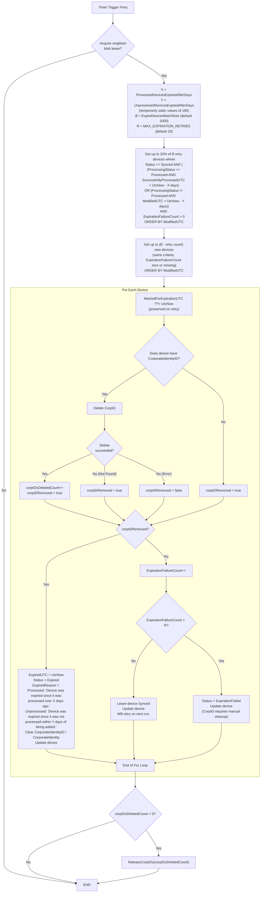

Expiration is calculated at run time from the current settings, so changing either setting applies to all existing devices.
`MarkedForExpirationUTC` records when expiration processing started for a device and is persisted with the outcome update.
