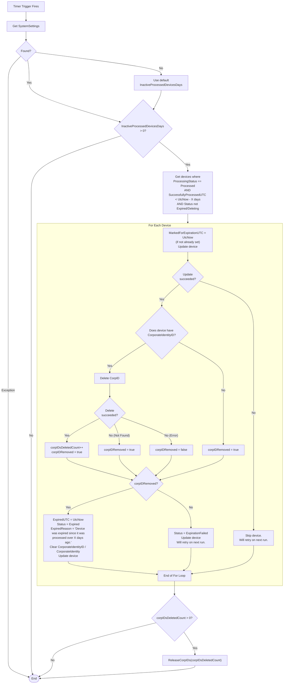

```mermaid

flowchart TD
    A["Timer Trigger Fires"] --> S["Get SystemSettings"]
    S --> S1{"Found?"}
    S1 -- "Exception" --> END(["End"])
    S1 -- "No" --> S2["Use default<br/>InactiveProcessedDevicesDays"]
    S1 -- "Yes" --> S3{"InactiveProcessedDevicesDays > 0?"}
    S2 --> S3
    S3 -- "No" --> END
    S3 -- "Yes" --> D["Get devices where<br/>ProcessingStatus == Processed<br/>AND SuccessfullyProcessedUTC < UtcNow - X days<br/>AND Status not Expired/Deleting"]
    D --> LOOP

    subgraph LOOP ["For Each Device"]
        direction TB

        MK["MarkedForExpirationUTC = UtcNow<br/>(if not already set)<br/>Update device"]
        MK --> MK1{"Update<br/>succeeded?"}
        MK1 -- "No" --> SKIP["Skip device.<br/>Will retry on next run."]
        MK1 -- "Yes" --> H{"Does device have CorporateIdentityID?"}

        H -- "No" --> N["corpIDRemoved = true"]
        H -- "Yes" --> I["Delete CorpID"]
        I --> J{"Delete<br/>succeeded?"}
        J -- "Yes" --> K["corpIDsDeletedCount++<br/>corpIDRemoved = true"]
        J -- "No (Not Found)" --> M["corpIDRemoved = true"]
        J -- "No (Error)" --> MM["corpIDRemoved = false"]

        K --> O{"corpIDRemoved?"}
        M --> O
        MM --> O
        N --> O

        O -- "Yes" --> P["ExpiredUTC = UtcNow<br/>Status = Expired<br/>ExpiredReason = 'Device was expired since it was<br/>processed over X days ago.'<br/>Clear CorporateIdentityID / CorporateIdentity<br/>Update device"]
        O -- "No" --> Q["Status = ExpirationFailed<br/>Update device<br/>Will retry on next run."]

        P --> Z["End of For Loop"]
        Q --> Z
        SKIP --> Z
    end

    Z --> AA{"corpIDsDeletedCount > 0?"}
    AA -- "No" --> END
    AA -- "Yes" --> AC["ReleaseCorpIDs(corpIDsDeletedCount)"]
    AC --> END

```
