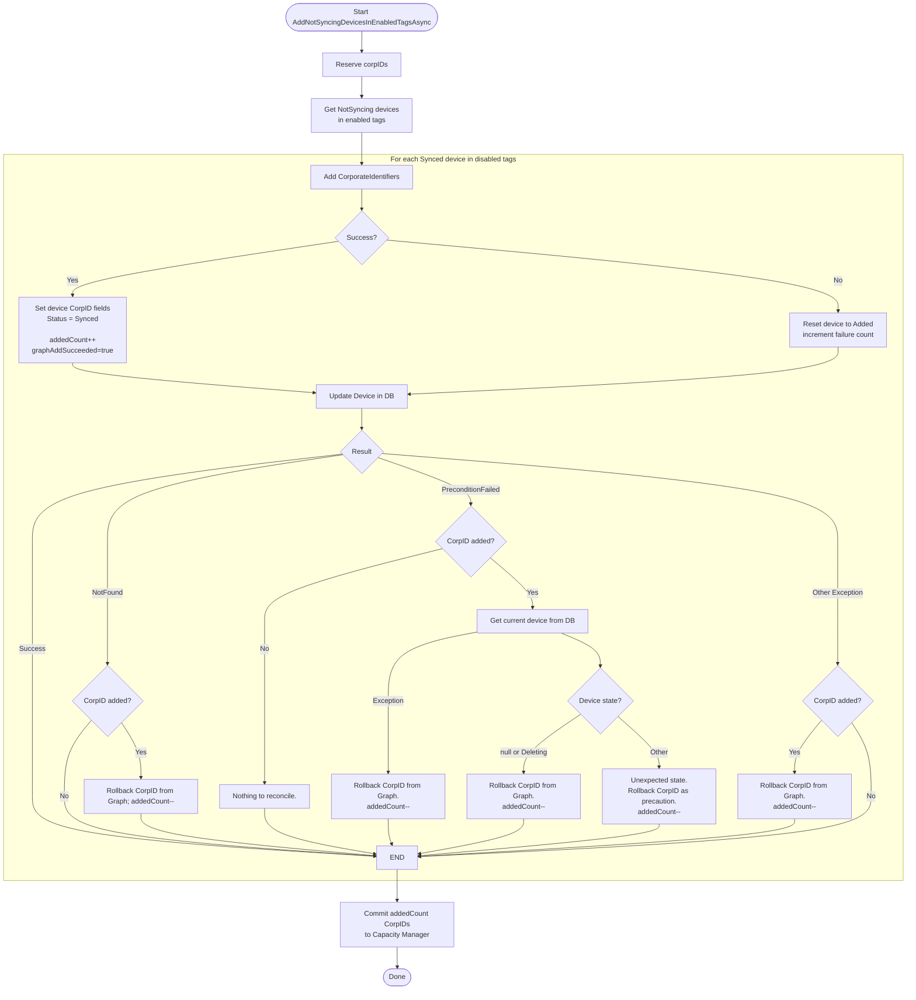

```mermaid

flowchart TD
    Start([Start AddNotSyncingDevicesInEnabledTagsAsync]) --> ReserveCorpIDs["Reserve corpIDs"]
    ReserveCorpIDs --> GetDevices[Get NotSyncing devices<br/>in enabled tags]
    GetDevices --> AddCorpIDs[Add CorporateIdentifiers]

    subgraph LOOP["For each Synced device in disabled tags"]
    direction TB

        AddCorpIDs --> AddOk{Success?}
        AddOk -- Yes --> SetSynced["Set device CorpID fields<br/>Status = Synced<br/><br/>addedCount++<br/>graphAddSucceeded=true"]
        AddOk -- No --> SetAdded[Reset device to Added<br/>increment failure count]
        SetSynced --> Update[Update Device in DB]
        SetAdded --> Update
        Update --> UpdResult{Result}
        UpdResult -- Success --> END
        UpdResult -- NotFound --> Rollback{CorpID added?}
        Rollback -- Yes --> DoRollback["Rollback CorpID from Graph; addedCount--"]
        Rollback -- No --> END
        DoRollback --> END

        UpdResult -- PreconditionFailed --> PF_GraphAdded{CorpID added?}
        PF_GraphAdded -- No --> PF_NoOp["Nothing to reconcile."]
        PF_NoOp --> END
        PF_GraphAdded -- Yes --> PF_Read[Get current device from DB]
        PF_Read -- Exception --> PF_ReadFail["Rollback CorpID from Graph.<br/>addedCount--"]
        PF_ReadFail --> END
        PF_Read --> PF_ReadResult{"Device state?"}
        PF_ReadResult -- "null or Deleting" --> PF_RollbackDel["Rollback CorpID from Graph.<br/>addedCount--"]
        PF_RollbackDel --> END
        PF_ReadResult -- Other --> PF_RollbackOther["Unexpected state.<br/>Rollback CorpID as precaution.<br/>addedCount--"]
        PF_RollbackOther --> END

        UpdResult -- Other Exception --> X_Check{CorpID added?}
        X_Check -- Yes --> X_Rollback["Rollback CorpID from Graph.<br/>addedCount--"]
        X_Rollback --> END
        X_Check -- No --> END
    end

    END --> Commit["Commit addedCount CorpIDs<br/>to Capacity Manager"]
    Commit --> Done([Done])
```