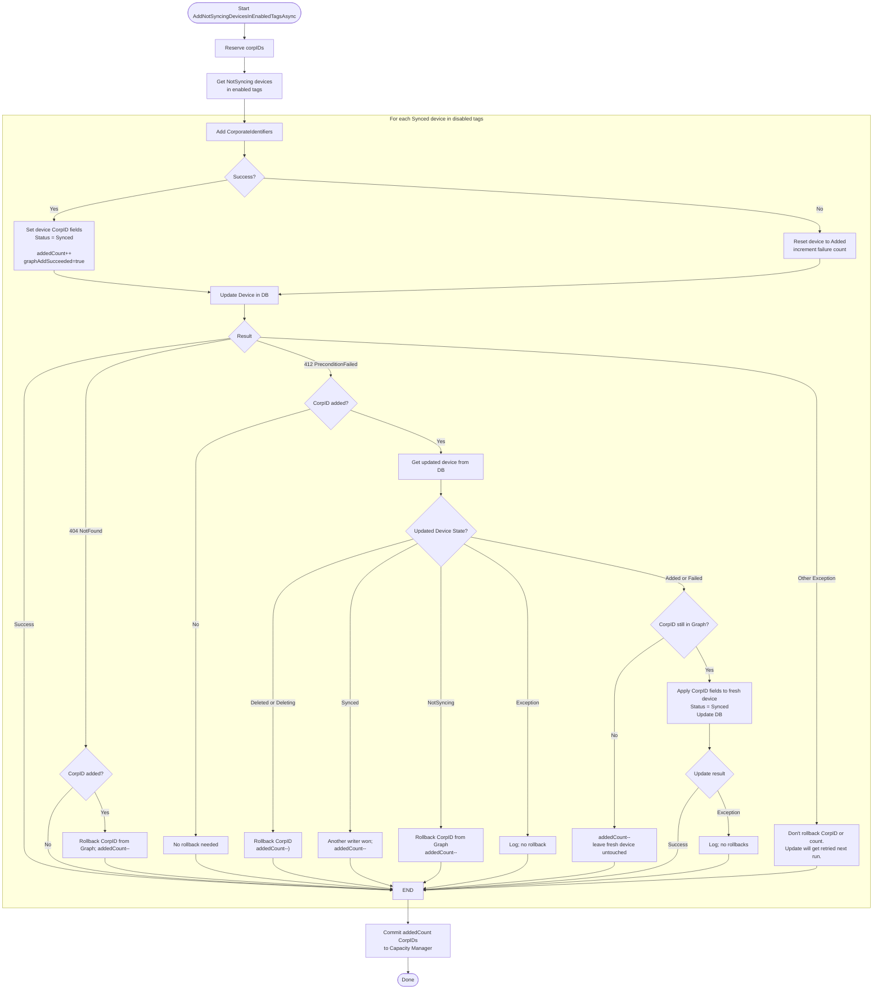

```mermaid

flowchart TD
    Start([Start AddNotSyncingDevicesInEnabledTagsAsync]) --> ReserveCorpIDs["Reserve corpIDs"]
    ReserveCorpIDs --> GetDevices[Get NotSyncing devices<br/>in enabled tags]
    GetDevices --> AddCorpIDs[Add CorporateIdentifiers]

    subgraph LOOP["For each Synced device in disabled tags"]
    direction TB

        AddCorpIDs --> AddOk{Success?}
        AddOk -- Yes --> SetSynced["Set device CorpID fields<br/>Status = Synced<br/><br/>addedCount++<br/>graphAddSucceeded=true"]
        AddOk -- No --> SetAdded[Reset device to Added<br/>increment failure count]
        SetSynced --> Update[Update Device in DB]
        SetAdded --> Update
        Update --> UpdResult{Result}
        UpdResult -- Success --> END
        UpdResult -- 404 NotFound --> Rollback{CorpID added?}
        Rollback -- Yes --> DoRollback["Rollback CorpID from Graph; addedCount--"]
        Rollback -- No --> END
        DoRollback --> END

        UpdResult -- 412 PreconditionFailed --> PF_GraphAdded{CorpID added?}
        PF_GraphAdded -- No --> PF_NoOp["No rollback needed"]
        PF_NoOp --> END
        PF_GraphAdded -- Yes --> PF_Read[Get updated device from DB]
        PF_Read --> PF_ReadResult{Updated Device State?}
        PF_ReadResult -- Deleted or Deleting --> PF_RollbackDel["Rollback CorpID<br/>addedCount--)"]
        PF_RollbackDel --> END
        PF_ReadResult -- Synced --> PF_Synced["Another writer won;<br/>addedCount--"]
        PF_Synced --> END
        PF_ReadResult -- NotSyncing --> PF_RollbackNS["Rollback CorpID from Graph<br/>addedCount--"]
        PF_RollbackNS --> END
        PF_ReadResult -- Added or Failed --> PF_Exists{CorpID still in Graph?}
        PF_Exists -- No --> PF_Gone["addedCount--<br/>leave fresh device untouched"]
        PF_ReadResult -- Exception --> PF_ReadFail["Log; no rollback"]
        PF_ReadFail --> END
        PF_Gone --> END
        PF_Exists -- Yes --> PF_Apply["Apply CorpID fields to fresh device<br/>Status = Synced<br/>Update DB"]
        PF_Apply --> PF_ApplyResult{Update result}
        PF_ApplyResult -- Success --> END
        PF_ApplyResult -- Exception --> PF_ApplyFail["Log; no rollbacks"]
        PF_ApplyFail --> END

        UpdResult -- Other Exception --> X["Don't rollback CorpID or count.</br>Update will get retried next run."]
        X --> END
    end

    END --> Commit["Commit addedCount CorpIDs<br/>to Capacity Manager"]
    Commit --> Done([Done])
```