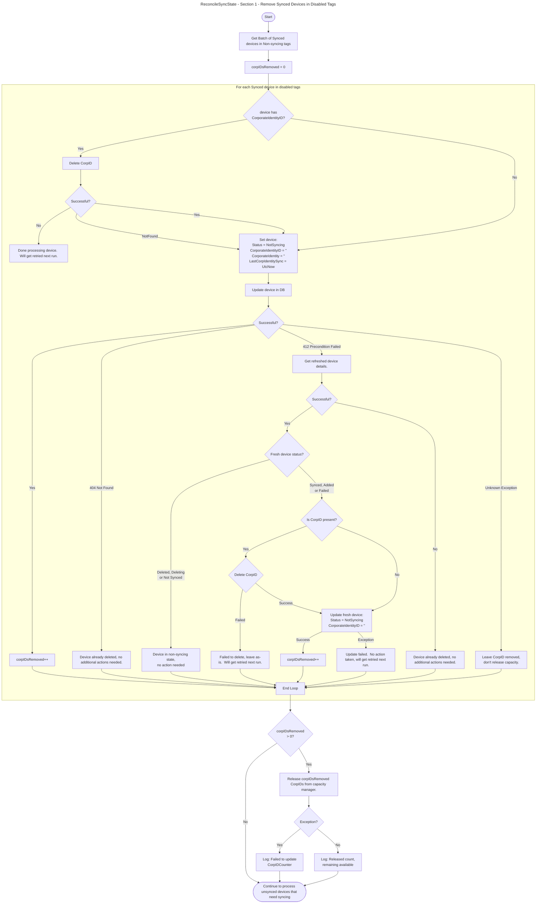

```mermaid

---
title: ReconcileSyncState - Section 1 - Remove Synced Devices in Disabled Tags
---
flowchart TD
	A([Start]) --> B["Get Batch of Synced devices in Non-syncing tags"]
	B --> C["corpIDsRemoved = 0"]
    C --> E

subgraph LOOP["For each Synced device in disabled tags"]
    direction TB
    E{"device has<br/>CorporateIdentityID?"}
    E -- Yes --> G["Delete CorpID"]
    G --> H{"Successful?"}
    H -- "No" --> AD["Done processing device.  Will get retried next run."]
    H -- "NotFound" --> K
    H -- Yes --> K
    E -- No --> K["Set device:<br/>Status = NotSyncing<br/>CorporateIdentityID = ''<br/>CorporateIdentity = ''<br/>LastCorpIdentitySync = UtcNow"]
    K --> M["Update device in DB"]
    M --> N{"Successful?"}
    N -- Yes --> AA["corpIDsRemoved++"]
    AA --> END["End Loop"]
    N -- "404 Not Found" --> O["Device already deleted, no additional actions needed."]
    O --> END
    N -- "412 Precondition Failed" --> P["Get refreshed device details."]
    N -- "Unknown Exception" --> X["Leave CorpID removed,<br/>don't release capacity."]
    X --> END
    P --> R{"Successful?"}
    R -- Yes --> RR{"Fresh device status?"}
    RR -- "Deleted, Deleting<br/>or Not Synced" --> RD["Device in non-syncing state,<br/>no action needed"]
    RD --> END
    RR -- Synced, Added<br/>or Failed --> RRR{"Is CorpID present?"}
    RRR -- Yes --> RDR{"Delete CorpID"}
    RDR -- Failed --> YYY["Failed to delete, leave as-is.  Will get retried next run."]
    YYY --> END
    RRR -- No --> T["Update fresh device:<br/>Status = NotSyncing<br/>CorporateIdentityID = ''"]
    RDR -- Success --> T
    S --> END
    R -- No --> S["Device already deleted, no additional actions needed."]
    T -- "Success" --> V["corpIDsRemoved++"]
    T -- "Exception" --> W["Update failed.  No action taken, will get retried next run."]
    V --> END
    W --> END
end

END --> ZA{"corpIDsRemoved<br/>> 0?"}
ZA -- No --> ZC([Continue to process unsynced devices that need syncing])
ZA -- Yes --> ZB["Release corpIDsRemoved CorpIDs from capacity manager."]
ZB --> ZD{"Exception?"}
ZD -- Yes --> ZE["Log: Failed to update<br/>CorpIDCounter"]
ZD -- No --> ZF["Log: Released count,<br/>remaining available"]
ZE --> ZC
ZF --> ZC

```