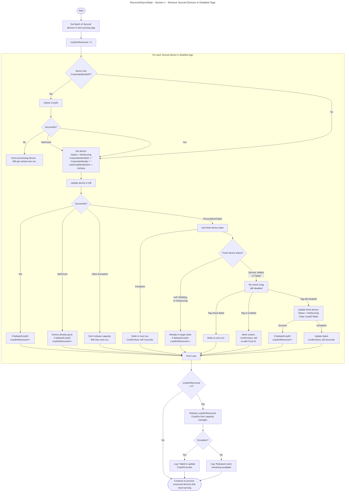

```mermaid

---
title: ReconcileSyncState - Section 1 - Remove Synced Devices in Disabled Tags
---
flowchart TD
	A([Start]) --> B["Get Batch of Synced devices in Non-syncing tags"]
	B --> C["corpIDsRemoved = 0"]
    C --> E

subgraph LOOP["For each Synced device in disabled tags"]
    direction TB
    E{"device has<br/>CorporateIdentityID?"}
    E -- Yes --> G["Delete CorpID"]
    G --> H{"Successful?"}
    H -- "No" --> AD["Done processing device.  Will get retried next run."]
    H -- "NotFound" --> K
    H -- Yes --> K
    E -- No --> K["Set device:<br/>Status = NotSyncing<br/>CorporateIdentityID = ''<br/>CorporateIdentity = ''<br/>LastCorpIdentitySync = UtcNow"]
    K --> M["Update device in DB"]
    M --> N{"Successful?"}
    N -- Yes --> AA["If deletedCorpID:<br/>corpIDsRemoved++"]
    AA --> END["End Loop"]
    N -- "NotFound" --> NF["Device already gone.<br/>If deletedCorpID:<br/>corpIDsRemoved++"]
    NF --> END
    N -- "PreconditionFailed" --> P["Get fresh device state"]
    N -- "Other Exception" --> X["Don't release capacity.<br/>Will retry next run."]
    X --> END
    P -- Exception --> PFAIL["Defer to next run.<br/>ConfirmSync will reconcile."]
    PFAIL --> END
    P --> RR{"Fresh device status?"}
    RR -- "null, Deleting,<br/>or NotSyncing" --> RD["Already in target state.<br/>If deletedCorpID:<br/>corpIDsRemoved++"]
    RD --> END
    RR -- "Synced, Added,<br/>or Failed" --> TAG["Re-check if tag<br/>still disabled"]
    TAG -- "Tag check failed" --> TAGFAIL["Defer to next run."]
    TAGFAIL --> END
    TAG -- "Tag re-enabled" --> TAGRE["Abort unsync.<br/>ConfirmSync will<br/>re-add Corp ID."]
    TAGRE --> END
    TAG -- "Tag still disabled" --> TAGUPD["Update fresh device:<br/>Status = NotSyncing<br/>Clear CorpID fields"]
    TAGUPD -- Success --> TAGOK["If deletedCorpID:<br/>corpIDsRemoved++"]
    TAGOK --> END
    TAGUPD -- Exception --> TAGERR["Update failed.<br/>ConfirmSync will reconcile."]
    TAGERR --> END
end

END --> ZA{"corpIDsRemoved<br/>> 0?"}
ZA -- No --> ZC([Continue to process unsynced devices that need syncing])
ZA -- Yes --> ZB["Release corpIDsRemoved CorpIDs from capacity manager."]
ZB --> ZD{"Exception?"}
ZD -- Yes --> ZE["Log: Failed to update<br/>CorpIDCounter"]
ZD -- No --> ZF["Log: Released count,<br/>remaining available"]
ZE --> ZC
ZF --> ZC

```